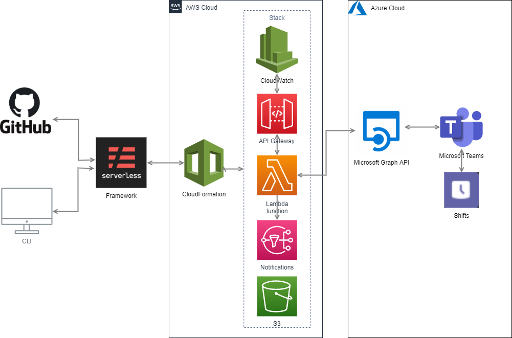

# aws-microsoft-shifts-explorer (Beta)
 A tool to explore Microsoft Shifts data

It is still considered as a Beta version because we use some features of the Microsoft Graph API which are currently in Beta version. 

## Use case
Your organization uses Microsoft Teams, and employees' planing are stored in Microsoft Shifts.
You want to get all users contact information for all shifts filtered by:
- a given period
or
- the next given week day

## Architecture

This module is fully serverless.



## Sample Request:

### getShiftsUsersForPeriod
```json
{
    "filters": {
        "sharedShiftPeriod": {
            "startDateTime": "2019-12-17T00:00:00.000Z",
            "endDateTime": "2019-12-18T00:00:00.000Z"
        },
        "shiftNamePattern": "(?i)duty"
    }
}
```

### getShiftsUsersForNextWeekDay
```json
{
    "filters": {
        "nextWeekday": "TUE",
        "shiftNamePattern": "(?i)duty"
    }
}
```

Possible values for `nextWeekday`: 
`MONDAY`, `TUESDAY`, `WEDNESDAY`, `THURSDAY`, `FRIDAY`, `SATURDAY`, `SUNDAY`, `MON`, `TUE`, `WED`, `THU`, `FRI`, `SAT`, `SUN`

## Sample Response:
```json
{
  "statusCode": 200,
  "body": [
    {
      "email": "romain.spinelli@foo.bar",
      "displayName": "Romain Spinelli",
      "shiftName": "Cloud Duty",
      "startDateTime": "2019-12-24T08:00:00Z",
      "endDateTime": "2019-12-24T17:00:00Z"
    },
    {
      "email": "john.smith@foo.bar",
      "displayName": "John Smith",
      "shiftName": "L2 Duty",
      "startDateTime": "2019-12-24T08:00:00Z",
      "endDateTime": "2019-12-24T17:00:00Z"
    },
    {
      "email": "tyrion.lannister@got.com",
      "displayName": "Tyrion Lannister",
      "shiftName": "L3 Duty",
      "startDateTime": "2019-12-24T08:00:00Z",
      "endDateTime": "2019-12-24T17:00:00Z"
    },
    {
      "email": "freddie.mercury@queen.uk",
      "displayName": "Freddie Mercury",
      "shiftName": "MGR Duty",
      "startDateTime": "2019-12-24T08:00:00Z",
      "endDateTime": "2019-12-24T17:00:00Z"
    }
  ]
}
```

# How to use it?

1. Install the Serverless Framework: https://serverless.com/
2. Configure your account and create at least one profile on your dashboard: https://dashboard.serverless.com/
3. Clone this repository
4. Uncomment this line in `serverless.yml` and replace `<YOUR_ORG>` with your Serverless Org:
   ```json
   # org: <YOUR_ORG>
   ```
5. Open a terminal on your local project directory:
`
$ sls deploy [--stage dev] [--region eu-west-1]
`

If you don't specify the `stage` and/or the `region`, il will use the values in the `custom` part of the `serverless.yml`:
 ```json
 custom:
    defaultRegion: eu-west-3
    defaultStage: dev
 ```
## Credentials

You have to store your Microsoft account credentials in a secure way:
1. Connect to the AWS Console: https://aws.amazon.com/fr/console/
2. Select the region you want to deploy the service
3. Go to Secrets Manager service
4. Click on "Store new secret" button
5. Select "Other type of secrets"
6. Click on "Plaintext" tab
7. Copy/paste the following code block in the "plan text" tab, and replace the attributes' values between `<>`:
 
```json
{
  "USERNAME": "<username>",
  "PASSWORD": "<password>",
  "TENANT_ID": "<tenant_id>",
  "TEAM_ID": "<team_id>",
  "SECRET_KEY": "<secret_key>",
  "CLIENT_ID": "<client_id>"
}
```

If you don't know how to valorize these attributes, connect to the Azure portal to find your own attributes:
https://portal.azure.com/

**Important**: 
- The user must belong to the team
- Advise: create a generic user in your Azure AD (without licence on Office products), and give it access to the tenant (TENANT_ID), and add it to the team (TEAM_ID)

8. Enter the Secret name: `Microsoft/Graph/API/ShiftsExplorer/<STAGE>`
 
 Replace `<STAGE>` with the value of your stage (used to deploy your application)
 Examples: 
  * `Microsoft/Graph/API/ShiftsExplorer/dev`
  * `Microsoft/Graph/API/ShiftsExplorer/test`
  * `Microsoft/Graph/API/ShiftsExplorer/prod`

## Notifications

If you want to be notified when something went wrong:
1. Go to the AWS Console: https://aws.amazon.com/fr/console/
2. Go to SNS service
3. Add a subscription (by email for example) to the topic named `aws-microsoft-shifts-explorer-notifier-<stage>`
